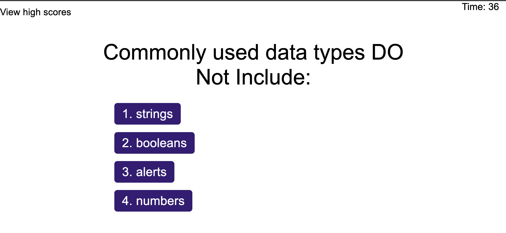

# coding-quiz-challenge
coding quiz challenge which is time bounded


## About Application

A typical coding assessment includes both multiple-choice questions and interactive coding challenges. 
Built a timed coding quiz with multiple-choice questions. This app will run in the browser and will feature dynamically updated HTML and CSS powered by JavaScript code that you write. It will have a clean, polished, and responsive user interface. 


## User Story

```
AS A coding boot camp student
I WANT to take a timed quiz on JavaScript fundamentals that stores high scores
SO THAT I can gauge my progress compared to my peers
```

## Acceptance Criteria

```
GIVEN I am taking a code quiz
WHEN I click the start button
THEN a timer starts and I am presented with a question
WHEN I answer a question
THEN I am presented with another question
WHEN I answer a question incorrectly
THEN time is subtracted from the clock
WHEN all questions are answered or the timer reaches 0
THEN the game is over
WHEN the game is over
THEN I can save my initials and my score
```

## Mock-Up

The following animation demonstrates the application functionality:




## Deployment and GIT hub url details

* Deployed application URL: https://nisha4r.github.io/coding-quiz-challenge/

* The URL of the GitHub repository: https://github.com/nisha4r/coding-quiz-challenge

* README.md : https://github.com/nisha4r/coding-quiz-challenge/blob/main/README.md

---


